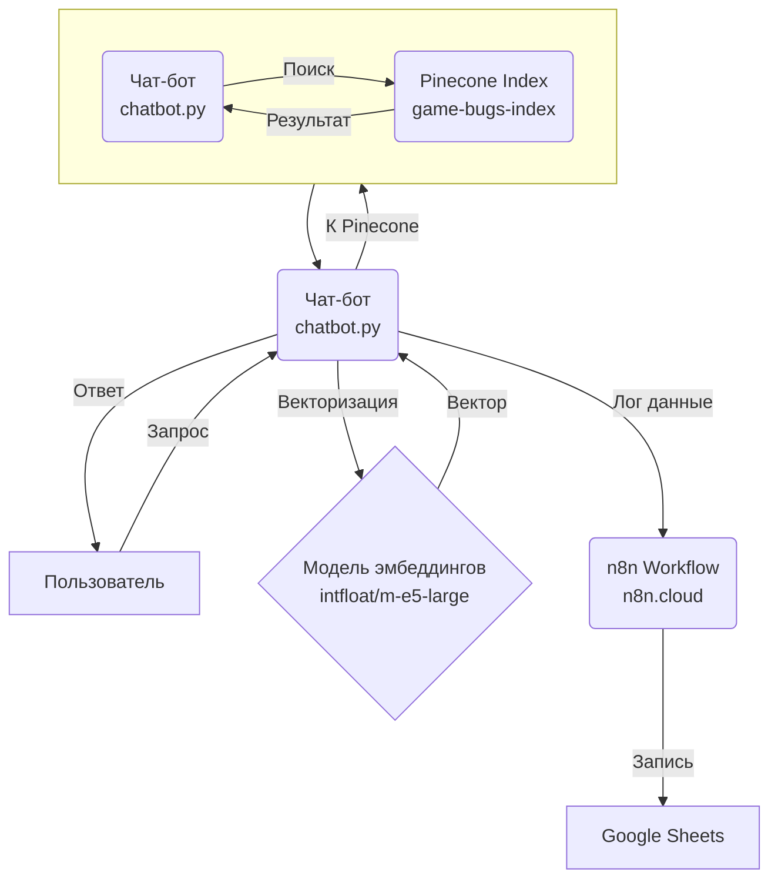
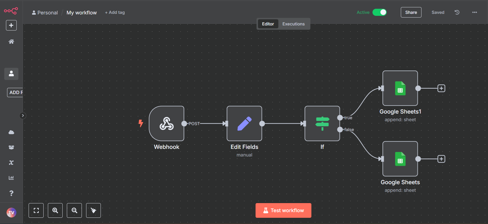
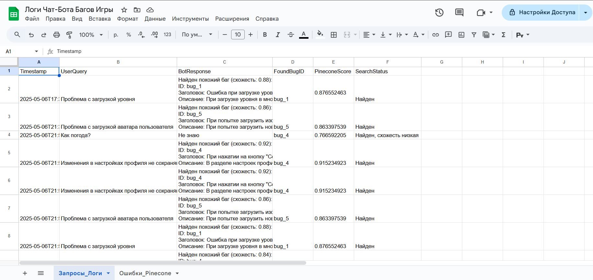
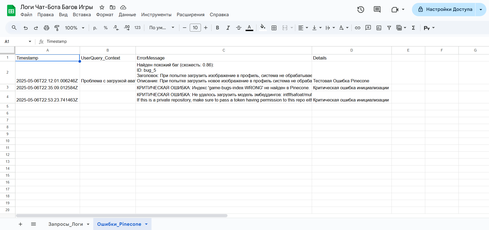
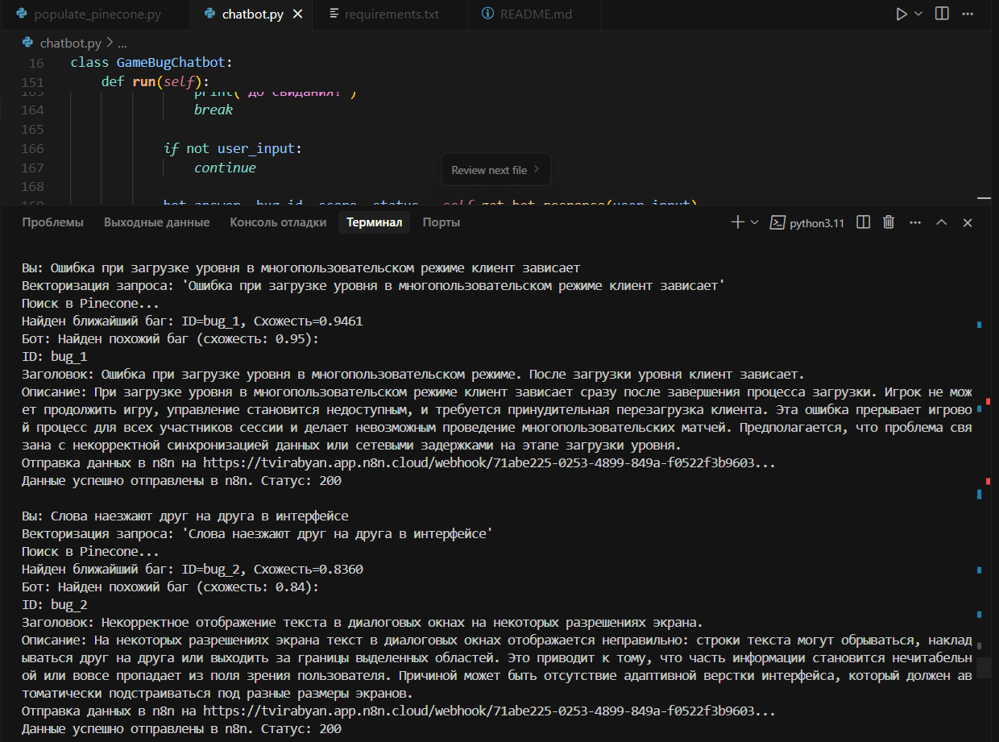
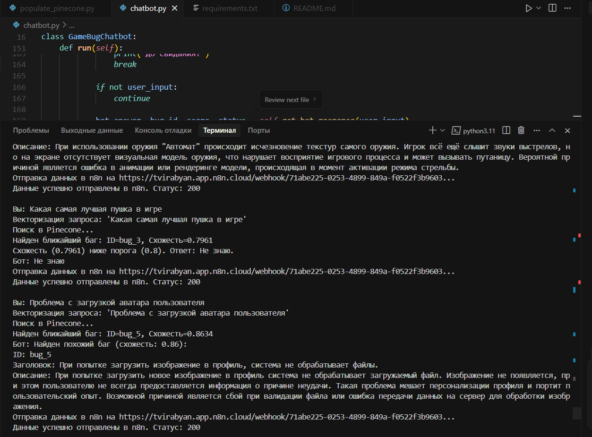

# Чат-бот для поиска информации о багах игры (Тестовое задание)

## 1. Описание проекта

Этот проект представляет собой чат-бота, разработанного для помощи пользователям в поиске информации об известных багах в игре. Бот использует векторную базу данных Pinecone для хранения описаний багов и технологию RAG (Retrieval Augmented Generation) для их поиска по текстовым запросам пользователей. Система интегрирована с n8n (через n8n.cloud) для автоматического логирования всех запросов, ответов бота и возникающих ошибок в Google Sheets.

**Цели задачи (согласно ТЗ):**
*   Разработать бота, интегрированного через n8n с Pinecone.
*   Использовать систему векторных баз данных для поиска информации о багах.
*   Реализовать функцию ответов на запросы пользователей о найденных багах.
*   Разработать подход для эффективного поиска информации о баге, даже при неточных запросах.
*   Обеспечить логирование запросов и ошибок через n8n в Google Sheets.
*   Если бот не находит релевантный ответ, он должен отвечать "Не знаю".

## 2. Архитектура и Принципы работы

### 2.1. Схема работы системы

**Примечание к схеме:** Узел "Чат-бот chatbot.py" появляется на схеме дважды. Основной узел представляет общую логику чат-бота, в то время как его второе появление внутри подграфа "Взаимодействие с Pinecone" детализирует шаги, выполняемые *этим же* чат-ботом при непосредственной работе с базой данных Pinecone. Это сделано для лучшей структуризации и читаемости этапов взаимодействия.

### 2.2. Поток обработки запроса пользователя:
1.  Пользователь отправляет текстовый запрос чат-боту, описывая проблему.
2.  Чат-бот (`chatbot.py`) принимает запрос.
3.  Текст запроса преобразуется в векторное представление (эмбеддинг) с помощью модели `intfloat/multilingual-e5-large`.
4.  Сформированный вектор запроса отправляется в индекс `game-bugs-index` в Pinecone.
5.  Pinecone выполняет поиск косинусного сходства и возвращает `top_k=1` (один) наиболее похожий вектор бага вместе с его метаданными (ID, оценка схожести, оригинальное описание).
6.  Чат-бот анализирует результат:
    *   Если совпадений не найдено или оценка схожести ниже установленного порога (`SIMILARITY_THRESHOLD`), бот отвечает "Не знаю".
    *   Если найдено релевантное совпадение, бот извлекает из метаданных оригинальное описание бага и формирует ответ для пользователя.
7.  Ответ отображается пользователю.
8.  Независимо от результата поиска, чат-бот формирует JSON-пакет с данными о запросе (сам запрос, ответ бота, ID найденного бага (если есть), оценка схожести, статус поиска, временная метка).
9.  Этот JSON-пакет отправляется методом HTTP POST на Webhook URL, предоставленный n8n.
10. Workflow в n8n принимает эти данные, обрабатывает их и записывает в соответствующий лист Google Sheets (`Запросы_Логи` или `Ошибки_Pinecone`).

### 2.3. Подготовка данных (скрипт `populate_pinecone.py`):
1.  Описания 5 багов из ТЗ берутся за основу.
2.  Для каждого бага формируется полный текст (заголовок + детальное описание).
3.  Этот текст преобразуется в векторное представление моделью `intfloat/multilingual-e5-large`.
4.  Полученные векторы вместе с уникальными ID (`bug_1`, ..., `bug_5`) и метаданными (оригинальный заголовок, оригинальное описание, полный текст для эмбеддинга) загружаются в индекс `game-bugs-index` в Pinecone. Этот процесс выполняется один раз для наполнения базы.

## 3. Требования и Установка

### 3.1. Необходимые компоненты:
*   Python 3.9 или выше.
*   Аккаунт [Pinecone](https://www.pinecone.io/) (можно использовать бесплатный тариф "Starter").
*   Аккаунт [n8n.cloud](https://n8n.cloud/) (можно использовать бесплатный тариф) или локально развернутый экземпляр n8n.
*   Аккаунт Google для использования Google Sheets.

### 3.2. Настройка окружения:
1.  **Клонируйте репозиторий (если применимо) или скачайте файлы проекта.**
2.  **Создайте и активируйте виртуальное окружение Python (рекомендуется):**
    ```bash
    python -m venv venv
    # Для Windows:
    venv\Scripts\activate
    # Для macOS/Linux:
    source venv/bin/activate
    ```
3.  **Установите зависимости:**
    Все необходимые Python библиотеки перечислены в файле `requirements.txt`. Установите их командой:
    ```bash
    pip install -r requirements.txt
    ```

### 3.3. Конфигурация компонентов:

#### 3.3.1. Pinecone
1.  Войдите в свой аккаунт Pinecone.
2.  **Создайте API ключ** (если еще не создан) и скопируйте его.
3.  **Создайте индекс** со следующими параметрами:
    *   **Index Name:** `game-bugs-index`
    *   **Dimensions:** `1024` (для модели `intfloat/multilingual-e5-large`)
    *   **Metric:** `cosine`
    *   **Capacity Mode:** `Serverless` (рекомендуется для старта)
    *   **Cloud Provider & Region:** Выберите доступные (например, AWS & us-east-1).
    *   **Model (для Integrated Embedding, если настраивали через UI):** `multilingual-e5-large`
        *   _Примечание: Скрипт `populate_pinecone.py` в текущей реализации сам генерирует эмбеддинги и загружает числовые векторы._

#### 3.3.2. Google Sheets
1.  Создайте новую таблицу Google Sheets (например, "Логи Чат-Бота Багов Игры").
2.  Создайте два листа (вкладки):
    *   **Лист 1: `Запросы_Логи`**
        *   Колонки (в первой строке): `Timestamp`, `UserQuery`, `BotResponse`, `FoundBugID`, `PineconeScore`, `SearchStatus`.
    *   **Лист 2: `Ошибки_Pinecone`**
        *   Колонки (в первой строке): `Timestamp`, `UserQuery_Context`, `ErrorMessage`, `Details`.

#### 3.3.3. n8n (n8n.cloud)
1.  Войдите в свой аккаунт n8n.cloud.
2.  **Создайте Credential для Google Sheets:**
    *   Перейдите в "Credentials" -> "Add credential".
    *   Выберите "Google Sheets API" и пройдите аутентификацию с Google Аккаунтом, где создана таблица логов.
3.  **Создайте новый Workflow "Логирование Чат-бота":**
    *   **Узел 1: Webhook (Триггер)**
        *   Authentication: `None`.
        *   HTTP Method: `POST`.
        *   Скопируйте **Production URL** этого Webhook. Он понадобится для `chatbot.py`.
    *   **Узел 2: Edit Fields (или Set)**
        *   Извлекает поля из `body` JSON-а (`timestamp`, `userQuery` и т.д.) в переменные n8n.
        *   Опция "Keep Only Set" включена.
    *   **Узел 3: IF**
        *   Маршрутизирует поток на основе `searchStatus`.
        *   Условие: `{{ $json.searchStatus.toLowerCase() }} contains "ошибка"`
        *   Выход `true` -> для листа `Ошибки_Pinecone`.
        *   Выход `false` (Default) -> для листа `Запросы_Логи`.
    *   **Узел 4: Google Sheets (для `Запросы_Логи` - ветка IF `false`)**
        *   Credential: Ваш Google Sheets credential.
        *   Operation: `Append Row`.
        *   Spreadsheet: Ваша таблица логов.
        *   Sheet Name: `Запросы_Логи`.
        *   Настройте маппинг колонок.
    *   **Узел 5: Google Sheets (для `Ошибки_Pinecone` - ветка IF `true`)**
        *   Credential: Ваш Google Sheets credential.
        *   Operation: `Append Row`.
        *   Spreadsheet: Ваша таблица логов.
        *   Sheet Name: `Ошибки_Pinecone`.
        *   Настройте маппинг колонок.
    *   **Активируйте Workflow** в n8n.

### 3.4. Настройка Python скриптов:

#### `populate_pinecone.py`:
*   Откройте файл `populate_pinecone.py`.
*   В константе `PINECONE_API_KEY` укажите ваш API ключ Pinecone.
*   Константа `PINECONE_INDEX_NAME` должна быть `game-bugs-index`.

#### `chatbot.py`:
*   Откройте файл `chatbot.py`.
*   В константе `PINECONE_API_KEY` укажите ваш API ключ Pinecone.
*   Константа `PINECONE_INDEX_NAME` должна быть `game-bugs-index`.
*   Константа `EMBEDDING_MODEL_ID` должна быть `'intfloat/multilingual-e5-large'`.
*   В константе `N8N_WEBHOOK_URL` укажите **Production URL** вашего Webhook из n8n.
*   При необходимости настройте `SIMILARITY_THRESHOLD` (например, `0.8`).

## 4. Подробные шаги реализации

Процесс разработки был разбит на несколько ключевых этапов, каждый из которых решал определенную часть задачи:

**4.1. Настройка и Конфигурация Pinecone:**
*   **Задача:** Подготовить облачную векторную базу данных для хранения и поиска информации о багах.
*   **Реализация:** Был сгенерирован API-ключ для аутентификации на [Pinecone.io](https://www.pinecone.io). Через веб-интерфейс Pinecone был создан serverless индекс `game-bugs-index`. Ключевыми параметрами индекса стали: размерность векторов `1024` (для модели `intfloat/multilingual-e5-large`) и метрика `cosine` (рекомендованная для задач семантического сходства текстовых данных). Выбор serverless режима был обусловлен его гибкостью и экономичностью для проектов с переменной нагрузкой.

**4.2. Подготовка данных и их Векторизация (скрипт `populate_pinecone.py`):**
*   **Задача:** Преобразовать предоставленные текстовые описания 5 багов в векторные представления и загрузить их в Pinecone.
*   **Реализация:**
    1.  В Python-скрипте `populate_pinecone.py` был определен список словарей, каждый из которых содержал ID, заголовок и детальное описание одного из 5 багов, указанных в ТЗ.
    2.  Для обеспечения максимального семантического охвата при векторизации, заголовок и описание каждого бага конкатенировались в единый текстовый блок.
    3.  Была использована предварительно обученная многоязычная модель `intfloat/multilingual-e5-large` из библиотеки `sentence-transformers` для преобразования каждого текстового блока в числовой вектор (эмбеддинг) размерностью 1024.
    4.  Сформированные векторы, вместе с их уникальными ID (например, `bug_1`) и метаданными (включающими `original_title`, `original_description` и `source_text_for_embedding` для последующего извлечения), были загружены в индекс `game-bugs-index` с помощью метода `upsert` клиента Pinecone.
    5.  Успешность операции проверялась по изменению `RECORD COUNT` в статистике индекса Pinecone.

**4.3. Разработка логики Чат-бота (скрипт `chatbot.py`):**
*   **Задача:** Создать приложение, способное принимать запросы пользователя, находить релевантные баги в Pinecone и формировать ответы, включая обработку ситуации "Не знаю".
*   **Реализация:**
    1.  Был создан класс `GameBugChatbot`, инкапсулирующий всю логику.
    2.  **Инициализация ресурсов:** При запуске бот загружает ту же модель `intfloat/multilingual-e5-large` и устанавливает соединение с Pinecone, используя API-ключ и имя индекса, указанные в конфигурации.
    3.  **Обработка запроса:**
        *   Входящий текстовый запрос от пользователя векторизуется с помощью загруженной модели.
        *   Полученный вектор запроса используется для выполнения `query` к индексу Pinecone, с параметрами `top_k=1` (для получения одного наиболее релевантного результата) и `include_metadata=True` (для доступа к сохраненным описаниям багов).
        *   **Механизм ответа "Не знаю":** Полученная от Pinecone оценка схожести (`score`) сравнивается с настраиваемым порогом `SIMILARITY_THRESHOLD`. Если совпадений нет или `score` ниже порога, бот формирует ответ "Не знаю". В противном случае, из метаданных извлекаются `original_title` и `original_description` бага, и формируется подробный ответ.
    4.  **Основной цикл:** Бот работает в цикле, принимая ввод от пользователя до команды "выход".

**4.4. Настройка Интеграции с n8n и Google Sheets для Логирования:**
*   **Задача:** Автоматизировать сбор логов о работе чат-бота.
*   **Реализация:**
    1.  В Google Sheets была создана таблица с двумя листами: `Запросы_Логи` (для всех взаимодействий) и `Ошибки_Pinecone` (для зафиксированных проблем).
    2.  В n8n.cloud был создан новый workflow. В качестве триггера использовался узел **Webhook**, настроенный на прием `POST` запросов. Был получен Production URL этого Webhook'а.
    3.  В n8n был настроен **Credential** для Google Sheets API, предоставляющий n8n доступ к таблице логов.
    4.  Workflow был дополнен узлом **"Edit Fields"** для структурирования входящих данных от Webhook и узлом **"IF"** для маршрутизации логов: если `searchStatus` (передаваемый от бота) содержит слово "ошибка" (нечувствительно к регистру), запись направляется в лист `Ошибки_Pinecone`; в противном случае – в `Запросы_Логи`.
    5.  Два узла **"Google Sheets"** были настроены для добавления строк (`Append Row`) в соответствующие листы, с маппингом полей из n8n в колонки таблицы.

**4.5. Интеграция Чат-бота с n8n Workflow:**
*   **Задача:** Обеспечить отправку данных из `chatbot.py` в n8n.
*   **Реализация:**
    1.  В `chatbot.py` Production URL Webhook'а из n8n был указан в константе `N8N_WEBHOOK_URL`.
    2.  Функция `log_to_n8n` была модифицирована для использования библиотеки `requests`. После каждой обработки запроса пользователя (или ошибки) она формирует JSON-объект (`log_payload`), содержащий `timestamp`, `user_query`, `bot_response_text`, `found_bug_id`, `pinecone_score` и `search_status`.
    3.  Этот `log_payload` отправляется `POST` запросом на `N8N_WEBHOOK_URL`. В функции реализована обработка возможных исключений при отправке (таймауты, ошибки соединения, HTTP ошибки).
    4.  Для логирования критических ошибок, возникающих на этапе инициализации бота (например, невозможность загрузить модель или подключиться к Pinecone), была добавлена функция `_prepare_and_send_init_error_log`, которая также вызывает `log_to_n8n`.

## 5. Подробное описание Тестирования

Тестирование системы проводилось комплексно, затрагивая все ключевые компоненты и сценарии, чтобы обеспечить соответствие требованиям ТЗ и корректную работоспособность.

**5.1. Корректность загрузки данных в Pinecone:**
*   **Метод:** После выполнения скрипта `populate_pinecone.py`, в веб-консоли Pinecone проверялась статистика индекса `game-bugs-index`.
*   **Ожидаемый результат:** Значение `RECORD COUNT` должно было измениться на `5`, что соответствует количеству загруженных описаний багов.
*   **Фактический результат:** Проверка подтвердила успешную загрузку всех 5 векторов багов.

**5.2. Работа чат-бота с различными типами запросов:**
*   **Нормальные запросы:** Использовались запросы, точно или очень близко описывающие формулировки багов из ТЗ (например, "Ошибка при загрузке уровня в многопользовательском режиме клиент зависает").
    *   *Ожидалось:* Бот должен был идентифицировать корректный баг с высокой оценкой схожести (score) и предоставить его полное описание.
    *   *Фактический результат:* Бот успешно находил соответствующие баги, оценка схожести была стабильно высокой (например, >0.85).
*   **Частичные или неточно сформулированные запросы:** Тестировались запросы с использованием синонимов, неполных фраз или опущенных деталей (например, "клиент виснет после загрузки уровня", "проблема с текстом в игре").
    *   *Ожидалось:* Бот должен был по-прежнему находить наиболее релевантный баг, если семантическая схожесть запроса с описанием бага была достаточной и превышала установленный `SIMILARITY_THRESHOLD`.
    *   *Фактический результат:* Бот демонстрировал способность находить релевантные баги даже по неточным запросам, что подтвердило эффективность векторного поиска.
*   **Нерелевантные запросы:** Использовались запросы, не имеющие отношения к багам или игровой тематике (например, "какая сегодня погода", "привет").
    *   *Ожидалось:* Бот должен был отвечать "Не знаю", так как оценка схожести с любым из багов должна была быть ниже `SIMILARITY_THRESHOLD`.
    *   *Фактический результат:* Бот корректно отвечал "Не знаю" на такие запросы.

**5.3. Подбор `SIMILARITY_THRESHOLD`:**
*   **Метод:** Значение `SIMILARITY_THRESHOLD` в `chatbot.py` итеративно изменялось (в диапазоне примерно от 0.6 до 0.85). На каждом значении порога проводилась серия тестов с релевантными, частично релевантными и нерелевантными запросами.
*   **Цель:** Найти оптимальное значение, которое минимизирует ложноположительные срабатывания (выдача бага на нерелевантный запрос) и ложноотрицательные срабатывания (ответ "Не знаю" на релевантный, но неточно сформулированный запрос).
*   **Фактический результат:** В результате экспериментов был выбран порог (например, `0.8`), обеспечивающий наилучший баланс точности и полноты ответов для данного набора данных и модели.

**5.4. Проверка взаимодействия с Pinecone:**
*   **Метод:** Наблюдение за логами чат-бота и ответами Pinecone в процессе тестирования различных запросов.
*   **Ожидаемый результат:** Отсутствие ошибок при выполнении `query` к Pinecone при корректно сформированном векторе запроса. Метаданные извлекаются правильно.
*   **Фактический результат:** При штатной работе взаимодействие с Pinecone проходило без сбоев.

**5.5. Проверка логирования и обработки ошибок через n8n:**
*   **Логирование успешных запросов и ответов "Не знаю" (не ошибочных):**
    *   *Метод:* Выполнение различных запросов к боту.
    *   *Ожидалось:* Каждое взаимодействие (запрос пользователя, ответ бота, ID найденного бага, score, статус) должно было логироваться в лист `Запросы_Логи` в Google Sheets через n8n workflow.
    *   *Фактический результат:* Все поля корректно записывались, подтверждая работу связки бот -> n8n -> Google Sheets.
*   **Логирование ошибок инициализации:**
    *   *Метод:* Имитация ошибок при запуске бота путем временного изменения констант в `chatbot.py` (например, `PINECONE_API_KEY` на неверный, `PINECONE_INDEX_NAME` на несуществующий, `EMBEDDING_MODEL_ID` на неверный).
    *   *Ожидалось:* Бот должен был перехватить ошибку, вывести сообщение в консоль, сформировать лог с `searchStatus` равным "Критическая ошибка инициализации" и отправить его в n8n. Запись об ошибке должна была появиться в листе `Ошибки_Pinecone`.
    *   *Фактический результат:* Система корректно обрабатывала и логировала ошибки инициализации в предназначенный лист Google Sheets.
*   **Логирование ошибок во время выполнения (векторизация, запрос к Pinecone):**
    *   *Метод:* Имитация ошибок путем временного внесения изменений в код `get_bot_response()` (например, `raise Exception` перед вызовом `encode()` или `query()`), либо передачей некорректных данных, способных вызвать сбой.
    *   *Ожидалось:* Бот должен был перехватить ошибку, ответить пользователю сообщением об ошибке, сформировать лог с соответствующим `searchStatus` ("Ошибка векторизации" или "Ошибка Pinecone при поиске") и отправить его в n8n. Запись должна была появиться в `Ошибки_Pinecone`.
    *   *Фактический результат:* Ошибки времени выполнения корректно обрабатывались и логировались.
*   **Проверка условия в узле IF в n8n:**
    *   *Метод:* Анализ записей в Google Sheets после различных тестовых сценариев (успешные запросы, нерелевантные запросы, ошибки).
    *   *Ожидалось:* Условие `searchStatus.toLowerCase() contains "ошибка"` должно было правильно маршрутизировать записи: содержащие "ошибка" в `searchStatus` – в `Ошибки_Pinecone`, остальные – в `Запросы_Логи`.
    *   *Фактический результат:* Маршрутизация в n8n работала корректно.

**5.6. Проверка логирования при ошибке связи с n8n:**
*   **Метод:** Имитация недоступности n8n путем указания неверного `N8N_WEBHOOK_URL` в `chatbot.py` или временной деактивации workflow в n8n.
*   **Ожидалось:** В консоли чат-бота должно было появиться сообщение об ошибке отправки данных в n8n (например, `ОШИБКА N8N LOG: Ошибка соединения...` или `HTTP ошибка...`). Данные в Google Sheets при этом не должны были записываться.
*   **Фактический результат:** Чат-бот корректно детектировал и сообщал в своей консоли о проблемах связи с n8n.

## 6. Структура проекта

*   `chatbot.py`: Основной файл с логикой чат-бота.
*   `populate_pinecone.py`: Скрипт для первоначального заполнения базы данных Pinecone.
*   `requirements.txt`: Файл с перечислением необходимых Python библиотек.
*   `README.md`: Данный файл документации.

## 7. Демонстрация работы (Скриншоты)

Для наглядной демонстрации настройки и работы системы ниже представлены ключевые скриншоты. Файлы скриншотов находятся в папке `screenshots`в корне проекта.

1.  **Конфигурация индекса в Pinecone:** Отображает параметры созданного индекса `game-bugs-index` и подтверждает загрузку 5 векторов.
    *   

2.  **Workflow в n8n:** Общая схема рабочего процесса в n8n, показывающая узлы Webhook, Edit Fields, IF и Google Sheets, а также связи между ними.
    *   

3.  **Логирование в Google Sheets:**
    *   Пример записей в листе `Запросы_Логи`: 
    *   Пример записей в листе `Ошибки_Pinecone`: 

4.  **Пример диалога с чат-ботом:**
    *   Успешный поиск и ответ: 
    *   Ответ "Не знаю" на нерелевантный запрос или запрос с низкой схожестью: 

## 8. Возможные улучшения (Roadmap)

*   Реализация более сложной логики RAG (например, использование LLM для генерации ответа на основе найденного контекста, а не просто вывод описания).
*   Добавление возможности для пользователей сообщать о новых багах через бота, с последующей их векторизацией и добавлением в Pinecone (возможно, через n8n).
*   Использование переменных окружения для хранения чувствительных данных (API ключи, URL Webhook'а) вместо хардкодинга.
*   Развертывание чат-бота как веб-сервиса (например, с использованием Flask/FastAPI) для интеграции с различными мессенджерами.
*   Более продвинутый мониторинг состояния Pinecone через n8n.